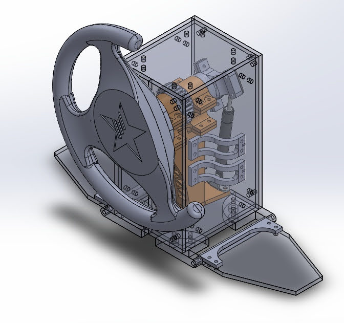

# 🚗 Blitz Vision Craft: VR RC Car Project

  
  
<b>Experience the thrill of RC car racing in immersive VR!</b>

## 🎞️ Product Showcase
**Get a closer look at Blitz Vision Craft in action!**

🔗 **Video:** [Watch here](https://youtube.com/shorts/zjXd_HjklBY?feature=share)

## ✨ The Dream Team: 전설의 메이커창작과 올스타 💫

**Brought to you by a team of passionate creators!**

- 김강현
- 조윤혁
- 장한수
- 송승현
- 김선우

## 📅 Project Timeline
**From concept to creation:**

⏳ November 15, 2023 - December 14, 2023 (Approximately 1 month)

## 🛠️ Tech Specs & Engineering Files
**Under the hood:**

*   **Core Technology:** VR-controlled RC car with real-time video streaming
*   **Key Components:** ESP32 board, webcam, VR headset, custom controller
*   **Communication:** ffmpeg for seamless socket communication

📁 *Engineering files available upon request (contact us below!)*

---

## 🚗 Introducing Blitz Vision Craft
**Redefining RC car experiences with the power of VR!**

Blitz Vision Craft is a groundbreaking graduation project that lets you control an RC car in real-time using VR technology. Utilizing an **ESP32 board** and **ffmpeg communication**, it establishes smooth socket communication between the controller and the car. Live webcam footage is streamed and transformed into a VR view, providing users with an incredibly immersive driving experience.

### 🎯 Key Features: Get Behind the Wheel!
- **Real-Time Video Streaming 📹:** ffmpeg ensures smooth and low-latency streaming of webcam footage directly to your VR headset.
- **Precision Control 🎮:** Our custom-designed controller offers precise and responsive handling of the RC car.
- **Immersive VR Experience 🕶️:** Experience the thrill of driving from the car's perspective with real-time feedback and control.
- **First-Person View (FPV) Racing:** Enjoy the immersive experience of FPV racing without the need for a drone.

### 🖼️ Controller Design
**Ergonomic and intuitive for ultimate control!**

  

### 🏆 Project Highlights
- ✅ **Successful Graduation Project** 🎓
- ✅ **Real-Time VR Control Achieved** 💡
- ✅ **Enhanced Driving Precision** 🎯
- ✅ **Innovative Use of VR Technology**
- ✅ **Responsive Handling and Control**

### 🌍 Future Vision: Beyond the Project
**The road ahead is full of possibilities!**

Blitz Vision Craft has the potential to evolve into a comprehensive **car simulation system**. We plan to improve the VR control system across diverse environments and apply it to various vehicle models.

*   **Expand to different terrains and environments**
*   **Develop a library of customizable vehicles**
*   **Implement advanced physics and realistic driving dynamics**
*   **Explore multiplayer racing and online leaderboards**

## 💬 Let's Connect!
**We're open to collaboration and feedback!** 😊

Feel free to reach out with any inquiries or collaboration proposals!